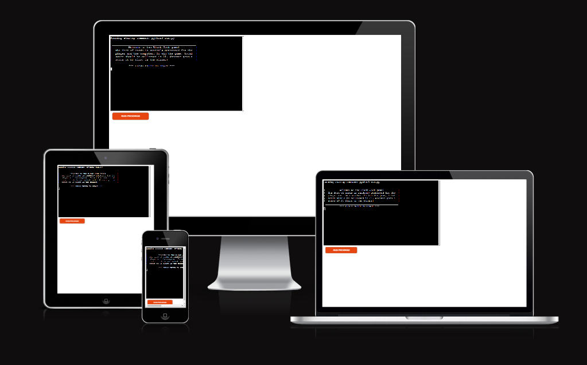
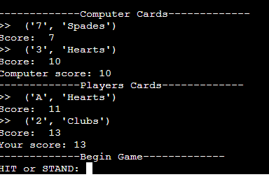
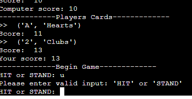
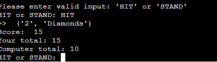
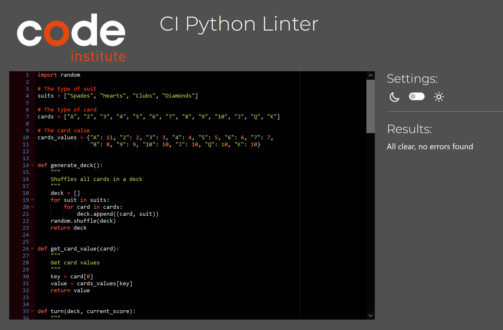

# Black Jack Game

BlackJack is a Python terminal game, which runs in the Code Institutes mock terminal on Heroku.

Users simply can try to beat the computer(dealer) by choosing which turn to take - 'HIT' or 'STAND'.

The link to the deployed game is here: [Black Jack Game](https://black-jack-game.herokuapp.com/)

  

## How to play

The game is simply generating cards for player and the computer(dealer). Once the cards are show, the user gets an option to choose 'HIT' or 'STAND'. If user typed 'HIT' another card has been added to their scores. If user typed 'STAND' the card has been generated for a computer. Once the score reaches 21 that is the winner of the game.

When game reaches to an end and either user or a delaer is a winner/loser the layer is prompt if they would like to play again. The player must enter 'N' for no and it will end a game, or 'Y' for yes and it will start the game from the beginning. 

## Features

- Random card generator, that shuffles all the cards and shows the cards.

  

- Accepts user input
- Validation in place for any random key being pressed.

 

- Displaying scores

- Plays against computer

### Future Features

- Hid the oponents card, so player doesn't see what the computer(delaer) has.

## Technologies and Languages Used

- Python
- Heroku for Deployment
- Github/Gitpod - version control

## Testing

The project has been manually tested by doing following:
- Testing in local and the deployed Heroku terminal.
- Giving wrong inputs, apart from exactly 'HIT' or 'STAND'.
- Passed code through PEP8 linter and confirmed there are no problems.

## Bugs

### Solved Bugs

- Indentation of the code kept failing, as some of the extra spaces after the code, or not 2 lines between the functions were left. These were kept in mind throughout the process and were fixed at time.
- While creating the validation to allow user to choose to repeat the game or not, there was no outcome coming. This occured as an empty string was declared before the while loop, once this was cleared, the code worked as should.

### Remaining Bugs

- No bugs remaining

## Validator Testing

- PEP8
    - No errors were found
      

## Deployment

### Heroku

This project was deployed on Heroku:
 - When you create the app, you will need to add two buildpacks from the _Settings_ tab. The ordering is as follows:

    1. `heroku/python`
    2. `heroku/nodejs`
    
- Add Config Var with the key PORT and the value is 8000.
- Connect your GitHub repository and deploy as normal.

Steps for deployment:
- Fork or clone this repository
- Create a new Heroku app
- Set the buildbacks and NodeJS in that order(as from above instruction)
- Link the Heroku app to the repository
- Click on Deploy

## Credits

- Code Institute for deployment terminal
- [techBytes io](https://www.youtube.com/watch?v=yJz2at4Hco4&t=605s) youtube channel for detailed explanations on each function and loop
- [BlackJack Python Beginner Tutorial](https://teachyourkidscode.com/blackjack-python-beginner-tutorial/)
- My mentor Martina
- And big Thanks to Irene from Code Institue for all the encouragement!

## Constraints

The deployment terminal is set to 80 columns by 24 rows. That means that each line of text needs to be 80 characters or less otherwise it will be wrapped onto a second line.

